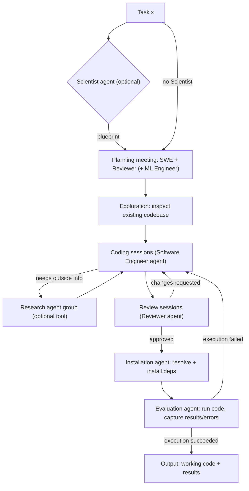

# Deep Thought — Agentic System Architecture (condensed)

**Source:** same paper as [do_challenge_notes.md](do_challenge_notes.md) — arXiv:[2504.19912](https://arxiv.org/abs/2504.19912), §4.2 ("Deep Thought agentic system") and Appendix E.

---

## 1. Two building blocks

- **Simple agents** — single-purpose workers for one well-defined sub-task (e.g. "install these dependencies", "run this file"). Each is tuned by two **Generation Behavior Settings (GBS)**: *creativity level* (how conservative vs. exploratory) and *temperature* (output randomness).
- **Agent groups** — several simple agents plus a manager, used when a task needs more than one kind of expertise at once (e.g. writing code *and* reviewing it). The manager coordinates turns, merges partial results, and summarizes.
- **Context management** — an *Observation Manager* compresses older turns into short summaries so long-running sessions don't blow the token budget. This matters a lot in practice (see Failure mode 2 below).

## 2. Shared toolset (5 categories)

| Tool category | What it lets an agent do |
|---|---|
| Research tools | Multi-step retrieval + reasoning over external sources, grounded in multiple materials |
| Coding tools | Create/modify files, manage versions, check compilation, search a codebase |
| Task management tools | Plan, decompose, and prioritize work (used by manager agents) |
| Editor & command execution | Read/edit files directly, run shell commands, install packages |
| Advanced search tools | Run a search (codebase or external) as an isolated call, so the results come back focused instead of bloating the calling agent's own context |

## 3. Agents and groups — who does what

| Agent / Group | Role |
|---|---|
| **Scientist agent** *(optional entry point)* | Reads the raw task and produces the action-plan "blueprint" the rest of the system follows. Enhanced variant — **Scientific Idea Tournament**: several idea-generator agents (different LLM providers/temperatures) each propose a plan; the plans are blind-compared pairwise and Elo-ranked; the top-rated plan becomes the blueprint. |
| **Software Engineer agent group** | The execution core. **Software Engineer agent** — the only one who actually writes/modifies code; runs the coding sessions. **ML Engineer agent** *(optional)* — advises on/integrates the ML-specific parts. **Reviewer agent** — inspects code for correctness and completeness, but never writes code itself. |
| **Evaluation & Installation agent group** | Makes the code actually run. **Installation agent** — figures out and installs dependencies in an isolated Conda environment, fixing conflicts as it goes. **Evaluation agent** — executes the code, diagnoses what broke, and returns a structured error report. |
| **Research agent group** *(optional tool, called by the Software Engineer agent mid-task)* | For external research. **Research Manager** orchestrates; **Web Searcher + Assistant** find and read sources; **Summarizer** distills them; **Ranking agent** orders insights by relevance; **Critic** quality-checks the final answer before it's handed back. Runs through 3 capped meeting types: *Web Search → Summarize → Rank*. In practice, strong primary models (Claude 3.7 Sonnet, Gemini 2.5 Pro, o1) almost never invoked this group; weaker models (GPT-4o) did, without much benefit. |

## 4. Full pipeline — what happens to a task `x`

Step by step:

1. **Entry.** Task `x` arrives (e.g. the DO Challenge or QM8 task description).
2. **(Optional) Blueprint.** The Scientist agent turns `x` into a concrete plan — possibly via the idea tournament.
3. **Planning meeting.** Software Engineer + Reviewer (+ ML Engineer if enabled) discuss the task/blueprint and agree on an implementation plan.
4. **Exploration.** Agents look at whatever project folder/codebase already exists.
5. **Coding loop.** The Software Engineer agent writes code across several solo sessions, then several more incorporating Reviewer feedback. It can optionally call the Research agent group mid-loop if it decides it needs outside information.
6. **Review.** The Reviewer does a pass for syntax errors, incomplete implementation, missing dependencies — can send it back to step 5.
7. **Install.** Once code is approved, the Installation agent resolves and installs dependencies in a fresh Conda environment.
8. **Evaluate.** The Evaluation agent runs the code and captures the outcome. On failure, it sends a structured error report back into the coding loop (step 5/6).
9. **Bounded repetition.** Steps 5–8 repeat until the code runs successfully and the Software Engineer agent confirms completion, or until the configured **engineering-effort level** (super low / low / medium / high — which caps how many coding/review/feedback rounds are allowed) is exhausted.
10. **Output.** Working code plus its executed results (and, in the DO Challenge context, this is also where a submission would be made).

## 5. Failure modes — compressed, mapped to where they bite

| # | Failure (short) | Where it happens | Design takeaway |
|---|---|---|---|
| 1 | Agent acknowledges a spec constraint (e.g. "the label is position-sensitive") but then still picks a method that violates it (e.g. a rotation-invariant featurization) | Coding | Don't trust the coder to hold every constraint in its head across a long task description — give the Reviewer an explicit checklist item for spec compliance. |
| 2 | Once a session's context passes roughly 20k–50k tokens, models stop calling the tools they were given and start hacking around them (writing ad hoc code instead) | Coding | Keep individual sessions short; lean on the Observation Manager's compression aggressively; watch token counts per session, not just per run. |
| 3 | A working solution gets built but never actually executed/submitted — the agent keeps "improving" it instead of running the version that already worked (seen with Claude 3.5 Sonnet as Software Engineer) | Coding → Evaluation handoff | Enforce "run early, run often": a cheap baseline must be executed and submitted before further iteration is allowed. |
| 4 | Multiple submission attempts are treated as independent events — no plan for what to do differently after seeing result 1, result 2, etc. | Planning / Scientist stage | Plan the submission sequence explicitly up front; don't leave it implicit. |
| 5 | The primary coding agent goes solo instead of engaging Reviewer/ML Engineer (model-specific — seen with Claude 3.7 Sonnet) | Software Engineer group | Collaboration isn't guaranteed by having the roles exist — may need to force it via process design (e.g. mandatory review gate) rather than assume it happens. |
| 6 | Some models kept requesting labels/compute after the budget was already fully spent | Spans the whole pipeline | Track the budget outside the LLM's own context — a hard-coded counter/guard, not something the agent has to remember. |
| 7 | Getting stuck in repeated bug-fix loops; sometimes "fixing" a broken test instead of the actual bug (mostly weaker models) | Evaluation ↔ Coding loop | Cap retries with a hard iteration limit; have the Evaluation agent explicitly distinguish "code is wrong" from "test is wrong." |
| 8 | Sophisticated architectures (GNNs, 3D CNNs) were rarely attempted, and did badly when they were, due to no real hyperparameter tuning | ML strategy | Sophistication isn't free — only worth attempting alongside an actual tuning budget; a simple, well-tuned model beat most fancy, under-tuned ones in their results. |
| 9 | Full compute/label budget spent on one big training push before any validation, so a bad outcome couldn't be recovered from | Resource management | Reserve part of the budget explicitly for validation before committing to a final push. |

## 6. Carry-over for the QM8 agent team

- Mirror the **plan → build → install → evaluate, with a hard-capped feedback loop** shape — it's the part of Deep Thought that worked, independent of which LLM sat in which seat.
- Track any budget (compute, API calls, "experiments run") as external state, not as something an agent is expected to keep track of in-context — failure #6 is exactly this.
- Give the Reviewer/Critic role an explicit checklist derived from the task spec, rather than trusting a single read of the task description — failure #1 is a spec-reading failure, not a modeling one.
- Decide up front whether cooperation between roles is mandatory (a gate) or optional (a suggestion) — failure #5 shows optional cooperation doesn't reliably happen even when the roles exist.
